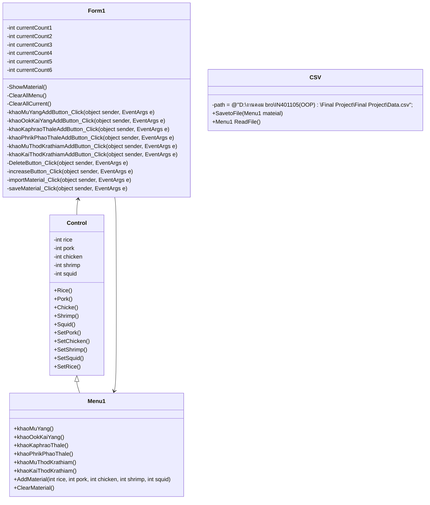

### ความเป็นมา
    ปัจจุบันได้มีการรับประทารอาหารนอกบ้านจำนวนมาก ทำให้เกิดร้านอาหารได้ทั่วไป ซึ่งได้เกิดปัญหาคือบางวัตถุดิบสำหรับบางเมนูได้หมดขึ้น จึงทำให้เกิดการชะรอเวลาในการบอกลูกค้าให้เปลี่ยนเมนู และเกิดความกังวลของเจ้าของร้านว่าวัตถุดิบจะเพียงพอต่อการทำอาหารหรือไม่ จึงได้สร้างโปรแกรมนี้เพื่อจัดการปัญหานั้น
### วัตถุประสงค์
        1.เพื่อศึกษาการเขียนโปรแกรมเชิงระบบ
        2.เพื่อช่วยเหลือเหล่าผู้ประกอบการร้านอาหาร
### โครงสร้างโปรแกรม

### ผู้พัฒนาโปรแกรม
        นายสินสมุทร ขุนพิมูล 663450310-9
